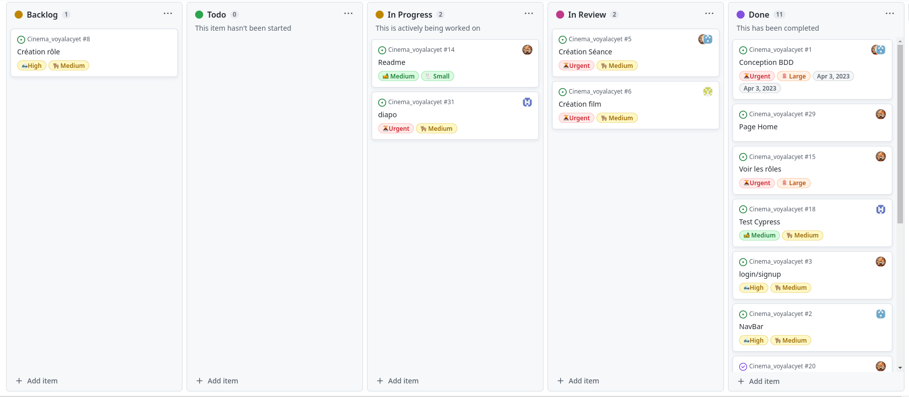

# Equipe Cinéma-Voyalacyet


## Organisation

### Notre équipe:

- Corentin GASPARD
- Antoine LEVA
- Thibaut GRONIER
- Théo LORIO

### Présentation de l'application :

Durant ce projet, nous avons decidé de developper un site permettant de réserver des places de cinéma. 
Le nom de notre site est : Cinéma-Voyalacyet.


### Présentation des outils utilisés

L'IDE que nous avons utilisé est WebStorm de la suite JetBrains, 
l'outil de versionning et de Trello utilisé est GitHub.
Nous avons utilisé PostMan afin de tester notre back avant de developper le front.
Afin de nous transmettre les liens et informations, pour nous aider, 
nous communiquions sur Discord dans un serveur que nous avons
créé pour le projet.

Les packages que nous avons utilisé sont les suivants : 

Back :
```
- "bcrypt": "^5.1.0",
- "cors": "^2.8.5",
- "express": "^4.18.2",
- "jsonwebtoken": "^9.0.0",
- "morgan": "^1.10.0",
- "nodemon": "^2.0.22",
- "passport": "^0.6.0",
- "passport-jwt": "^4.0.1",
- "sqlite3": "^5.1.4"
```
---------------------------------

Front :
```
- "@fortawesome/fontawesome-svg-core": "^6.4.0",
- "@fortawesome/free-solid-svg-icons": "^6.4.0",
- "@fortawesome/react-fontawesome": "^0.2.0",
- "@testing-library/jest-dom": "^5.16.5",
- "@testing-library/react": "^13.4.0",
- "@testing-library/user-event": "^13.5.0",
- "axios": "^0.27.2",
- "bootstrap": "^5.2.3",
- "jsonwebtoken": "^9.0.0",
- "jwt-decode": "^3.1.2",
- "mdb-react-ui-kit": "^6.0.0",
- "react": "^18.2.0",
- "react-bootstrap": "^2.7.0",
- "react-cookie": "^4.1.1",
- "react-dom": "^18.2.0",
- "react-icons": "^4.8.0",
- "react-router-dom": "^6.6.1",
- "react-scripts": "5.0.1",
- "styled-components": "^5.3.9",
- "web-vitals": "^2.1.4"

```

## Gestion de projet
 Durant ce projet, nous avons choisi d'utiliser la methode agile, car il s'agit de la méthode la plus optimisée afin de developper un projet.<br>
 Pendant ce projet, aucun membre n'avait de role précis, mais Thibaut travaillait en parallèle sur les merges des différentes branches.<br>
Comme nous étions réunis au même endroit, nous n'avons pas fait de réunion à proprement parler mais nous avons discuté constamment des problèmes que nous avons rencontrés en cours de route.

### Journée type :
- 9h : Discussion des tâches à faire ainsi que du Code Review 
- 11h30 : Repas
- 12h15 : Brainstorming
- 12h30/40 : Reprise du développement du projet
- 17h : Fin de journée

### Outils de Suivie

[Trello](https://github.com/users/gronier/projects/2/views/1)


## Application

### Fonctionnalités obligatoires

| Fonctionnalité                                                   | Fonctionne totalement | Fonctionne partiellement | Ne fonctionne pas | Non fait | Réalisé par        |
|------------------------------------------------------------------|--------------------|--------------------------|-------------------|----------|--------------------|
| Base de Donnée                                                   |         ✔️         |                          |                   |          | Corentin / Antoine |
| Connexion/ Inscription                                           |         ✔️         |                          |                   |          | Corentin           |
| Page Home avec description de notre cinéma                       |         ✔️         |                          |                   |          | Corentin           |
| Navbar                                                           |         ✔️         |                          |                   |          | Antoine            |
| Page Film avec la liste des films                                |         ✔️         |                          |                   |          | Théo               |
| Page Form Create Film                                            |         ✔️         |                          |                   |          | Théo               |
| Page Form Update Film                                            |         ✔️         |                          |                   |          | Théo               |
| Delete Film                                                      |         ✔️         |                          |                   |          | Théo               |
| Page réservation avec la liste des réservations de l'utilisateur |         ✔️         |                          |                   |          | Thibaut            |
| Page Form Create Reservation                                     |         ✔️         |                          |                   |          | Thibaut            |
| Annulation de réservation                                        |         ✔️         |                          |                   |          | Thibaut            |
| Détail des films des réservations                                |         ✔️         |                          |                   |          | Thibaut            |
| Séance relié à une salle                                         |                   |                          |          ️         |      ✔️     | Antoine            |
| Page Seance avec un calendrier et la liste des séance            |         ✔️         |                          |                   |          | Antoine/Corentin   |
| Page Form Create Seance                                          |         ✔️         |                          |                   |          | Antoine/Corentin   |
| Page Form Update Seance                                          |         ✔️         |                          |                   |          | Antoine/Corentin   |
| Delete Seance                                                    |         ✔️         |                          |                   |          | Antoine            |
| Page Salle avec la liste des salles                              |         ✔️         |                          |                   |          | Thibaut            |
| Page Form Create Salle                                           |         ✔️         |                          |                   |          | Thibaut            |
| Page Form Update Salle                                           |         ✔️         |                          |                   |          | Thibaut            |
| Delete Salle                                                     |         ✔️         |                          |                   |          | Thibaut            |
| Test Back                                                        |         ✔️         |                          |                   |          | Corentin           |
| Test Front                                                       |         ✔️         |                          |                   |          | Theo               |
| Test Cypress                                                     |         ✔️         |                          |                   |          | Thibaut            |

### Fonctionnalités obligatoire

| Fonctionnalité                        | Fonctionne totalement | Fonctionne partiellement | Ne fonctionne pas | Non fait | Réalisé par            |
|---------------------------------------|--------------------|--------------------------|-------------------|----------|------------------------|
| Ajout d'un carousel dans la page Home |         ✔️         |                          |                   |          | Corentin               |
| Création de role                      |                |                          |                   |      ✔️       |  |

## Mise en place


Vous devez ouvrir 2 terminaux afin de lancer le programme

Terminal 1 :
```
cd back
npm install
npm run resetDB
npm run start 
```
Terminal 2 :
```
cd front
npm install
npm run start 
```

Afin d'accéder à toutes les pages, vous devez créer un compte (le compte Client et Etudiant ont accès a la page réservation et le role Employé a accès a toutes les pages).
Une fois le compte créé, vous allez être redirigé vers la page "Login" pour vous connecter puis vous allez être redirigé à la page d'accueil et ensuite vous pourrez naviguer sur le site comme vous le voulez.

___________________________________________________________


#### Pour lancer les tests :

Back :

```
cd back
npm run mocha
```
Front :

```
cd front
npm run test
```

Cypress :

```
cd front
./node_modules/.bin/cypress open
```

## Rétrospective

### Difficultés rencontrées

Les difficultés que nous avons rencontrées sont :
- La réalisation du calendrier pour pouvoir afficher les séances d'un film
- Récupérer les données qui sont référencées par des clés étrangères

### Force de l'équipe

Les forces de notre équipe durant ce projet sont :
- L'entraide lorsqu'un problème a été découvert
- Bonne organisation dans l'équipe

### Gestion des risques

Lors du projet, nous avons chacun créé des branches différentes 
pour pouvoir travailler sur notre partie avant de fusionner nos travaux et 
ainsi, éviter de rendre le site inutilisable suite aux modifications.

### Amélioration Possible

Dans les améliorations possibles, nous avons en grande partie l'amélioration de la partie frontend et 
l'affichage des films lorsqu'on réserve une séance.

### Changement Possible

Dans les changements possibles, il y a l'utilisation d'autres outils, 
framework en javascript pour la partie backend. 
